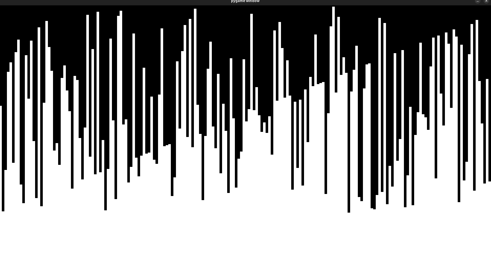
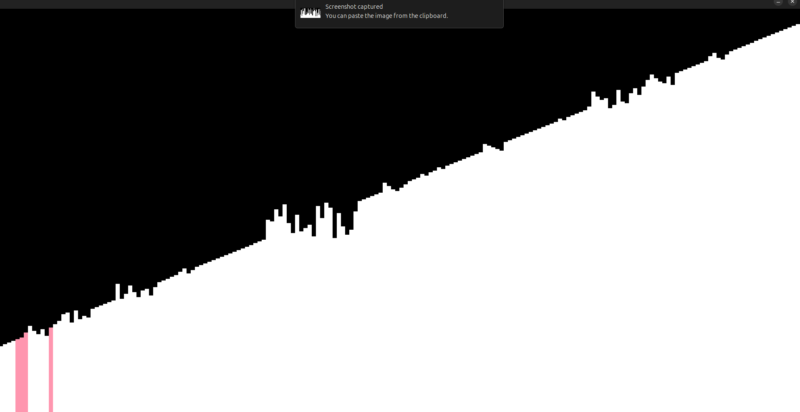
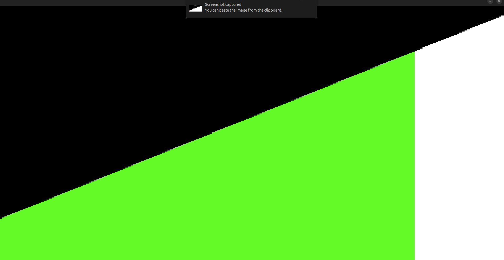

# SortingTypeBeat

A Python + Pygame sorting visualizer that turns sorting operations into both motion and sound. The app shuffles an array, visualizes each algorithm step in real time, and plays generated tones mapped to element values.

## Project Overview

SortingTypeBeat is an interactive desktop project for exploring how sorting algorithms behave step by step.

At runtime, the application:
- creates an ordered array,
- repeatedly shuffles it,
- renders sorting progress as animated vertical bars,
- generates per-value WAV files,
- and plays tones during comparisons / updates.

The result is a combined visual + audio representation of algorithm behavior.

## Screenshots

### Shuffle phase



### Sorting phase



### Sorted highlight phase



## Features

- Real-time sorting visualization using full-screen Pygame rendering.
- Audio feedback for active elements and final sorted animation.
- Pre-generated WAV tones (`audio/<index>.wav`) mapped to array values.
- Incremental algorithm execution per frame (not a one-shot sort call).
- Configurable runtime constants in `main.py`:
  - `NUMBER_OF_ELEMENTS`
  - `FPS`
  - `SORTING_ALGORITHM`

## Architecture / Structure

```text
SortingTypeBeat/
├── main.py                # Application loop, event handling, algorithm dispatch
├── logic.py               # Utility logic (shuffle + sorted check)
├── graphics.py            # Bar rendering + highlight behavior + sound triggers
├── audio.py               # Tone generation, WAV writing, playback helpers
├── SortingAlgorithms.py   # Stepwise sorting algorithm implementations
└── audio/                 # Generated WAV files
```

### Module responsibilities

- **`main.py`** orchestrates lifecycle: setup, shuffle animation, sorting loop, and finish animation.
- **`SortingAlgorithms.py`** exposes stepwise functions (`bubbleSort`, `selectSort`, `insertionSort`, `quickSort`) with a shared return pattern.
- **`graphics.py`** draws bars and highlights active indices while triggering matching tones.
- **`audio.py`** generates sine-wave samples and stores/plays WAV files.
- **`logic.py`** provides small state helpers used by the loop.

## Build & Run Instructions

### Prerequisites

- Python 3.9+
- `pygame`

### Setup

```bash
# From the project root
python -m venv .venv
source .venv/bin/activate
pip install pygame
```

### Run

```bash
python main.py
```

### Optional configuration

Edit constants in `main.py` before running:
- `SORTING_ALGORITHM`: `"bubbleSort"`, `"insertSort"`, `"quickSort"` (merge sort path is currently a placeholder)
- `NUMBER_OF_ELEMENTS`: controls array size and tone count
- `FPS`: controls update speed

## Testing

This repository currently does not include an automated test suite.

Current validation is manual:
- run `python main.py`,
- verify the array is shuffled then sorted,
- confirm bar highlighting and audio playback follow active elements,
- and verify the final sorted animation completes.

If you plan to extend the project, good first automated tests would target:
- sorting step invariants in `SortingAlgorithms.py`,
- `logic.isSorted`,
- and boundary behavior for small arrays.

## Project Context

This project is best viewed as an educational / exploratory tool:
- It demonstrates algorithm progress frame-by-frame rather than optimizing throughput.
- It couples visual state changes with simple audio synthesis for intuition and engagement.
- It is organized as lightweight modules so individual concerns (sorting, rendering, audio) are easy to modify independently.

## Notes

- The `audio/` directory is expected to exist so generated WAV files can be written.
- Audio playback timing currently uses blocking waits, which keeps behavior simple but may affect smoothness at larger sizes.
